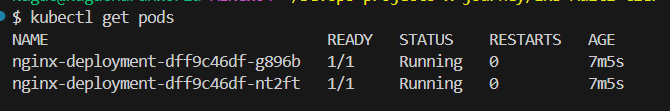
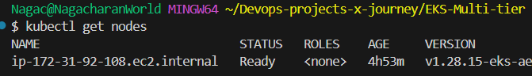
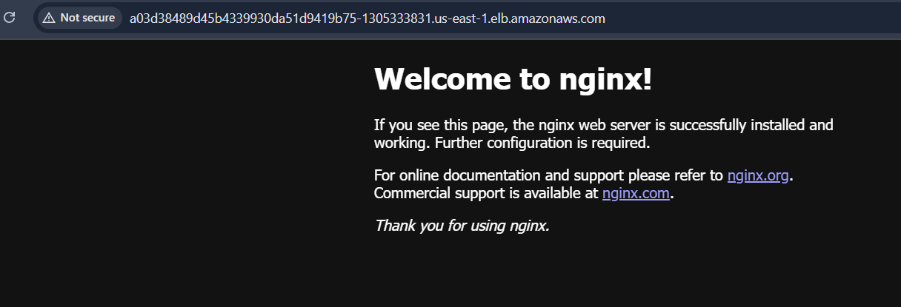
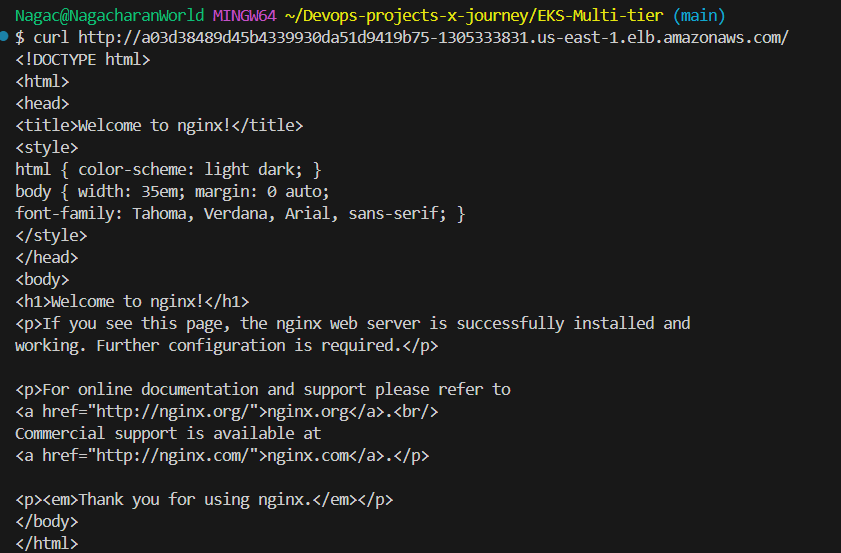

# EKS Multi-tier setup 

- This project deploys a 3-tier app (NGINX frontend, Go API backend, Redis database) on AWS EKS using Terraform and Kubernetes

## Prerequisites (Before You Start)

AWS Account: Free tier or low-cost—set up with IAM user (Admin access for simplicity).

Tools:
AWS CLI: aws --version (install if missing: curl "https://awscli.amazonaws.com/awscli-exe-linux-x86_64.zip" -o "awscliv2.zip").

Terraform: terraform -v (install: wget https://releases.hashicorp.com/terraform/1.6.6/terraform_1.6.6_linux_amd64.zip).

kubectl: kubectl version --client (install: curl -LO "https://dl.k8s.io/release/$(curl -L -s https://dl.k8s.io/release/stable.txt)/bin/linux/amd64/kubectl").

Git: For github.com/charan-happy.

## step 1 : Initial Setup

- AWS Config: aws configure—enter Access Key, Secret Key, region (e.g., us-east-1), format (json

## Step 2: Terraform an EKS Cluster

Provision an AWS EKS cluster with worker nodes

1. create a project directory & move into it

2. write terraform file (main.tf)
Find VPC/Subnet IDs: AWS Console → VPC → Your default VPC → Subnets (pick 2 in different AZs, e.g., us-east-1a, us-east-1b).

3. Initialize and apply
```
terraform init 
terraform plan
terraform apply --auto-approve
```

4. Configure kubectl 
```
aws eks update-kubeconfig --name charan-eks --region us-east-1
kubectl get nodes
```
## step 3 : Deploy nginx Frontend

>> frontend << nginx-deployment.yml

apply 

```
kubectl apply -f nginx-deployment.yaml
kubectl get pods
kubectl get svc
```
Wait ~2 min, then grab the EXTERNAL-IP from kubectl get svc nginx-service—test it in a browser (e.g., http://<EXTERNAL-IP>).

## Step 4: Deploy Go API Backend

backend

```
docker build -t charanhappy/go-api:latest .
docker push charanhappy/go-api:latest  # Assumes Docker Hub login
```

APPLY :
```
kubectl apply -f go-deployment.yaml
kubectl get pods
```
Step 5 : deploy redis as a database

```
kubectl apply -f redis-deployment.yaml
kubectl get pods
```

step 6: Commit and Test

1. Git push 

```
git add .
git commit -m "Initial EKS multi-tier app: NGINX, Go API, Redis"
git remote add origin https://github.com/charan-happy/eks-multi-tier.git
git push -u origin main
```
- Create repo first if it is not done yet in github 

Test 

```
kubectl get svc—hit NGINX’s EXTERNAL-IP in a browser.

kubectl port-forward svc/go-service 8080:8080—test localhost:8080 locally.
```










```
docker build -t <dockerlogin username>/go-api:latest .
docker push
```